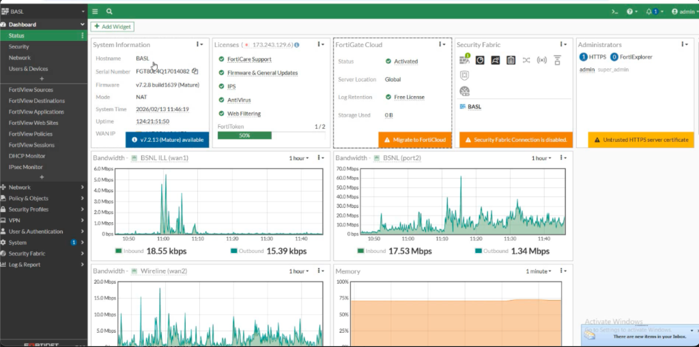
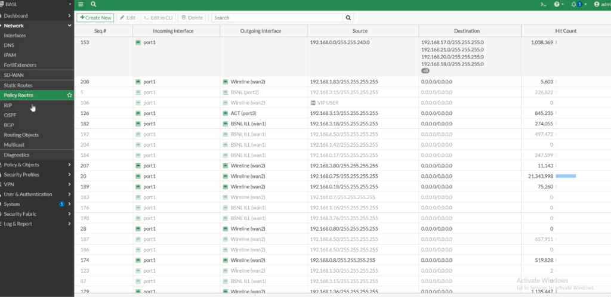
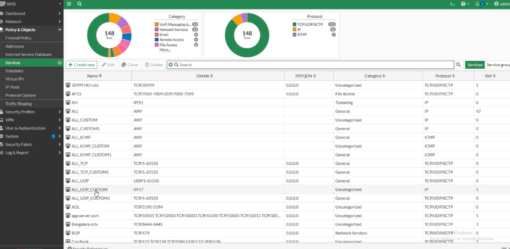

# 🛡️ FortiGate 80E Configuration & Security Lab

## 📝 Overview
This project showcases the configuration and management of a **FortiGate 80E** firewall in an enterprise environment. It demonstrates proficiency in SD-WAN optimization, security policy management, and granular web filtering for multi-ISP connectivity.

---

## 📸 Configuration Snapshots

### 1. System Dashboard
> Real-time monitoring of system health, license status, and multi-ISP bandwidth usage (BSNL ILL, Wireline).



---

### 2. Policy-Based Routing & SD-WAN
> Granular routing policies for traffic distribution across multiple WAN links, ensuring optimal performance for critical services.



---

### 3. Web Filtering & Security Profiles
> Implementation of category-based web filtering (Level 1 to Level 4) to enforce organizational security policies and reduce risk.



---

## 📂 Project Structure

```
├── README.md
└── Screenshots/
    ├── dashboard.png
    ├── policy_routes.png
    └── web_filter.png
```

---

## 🧠 Skills Demonstrated

- **Multi-WAN Management**: Configuring and optimizing SD-WAN and policy routes for redundant ISP connections.
- **Firewall Policy Administration**: Managing incoming and outgoing traffic rules with a focus on security and performance.
- **Security Profiles**: Implementing Web Filtering, AntiVirus, and IPS to protect the enterprise network.
- **System Monitoring**: Using Fortios dashboards for health checks and resource auditing.

---
*"Securing and optimizing enterprise edge connectivity."*
